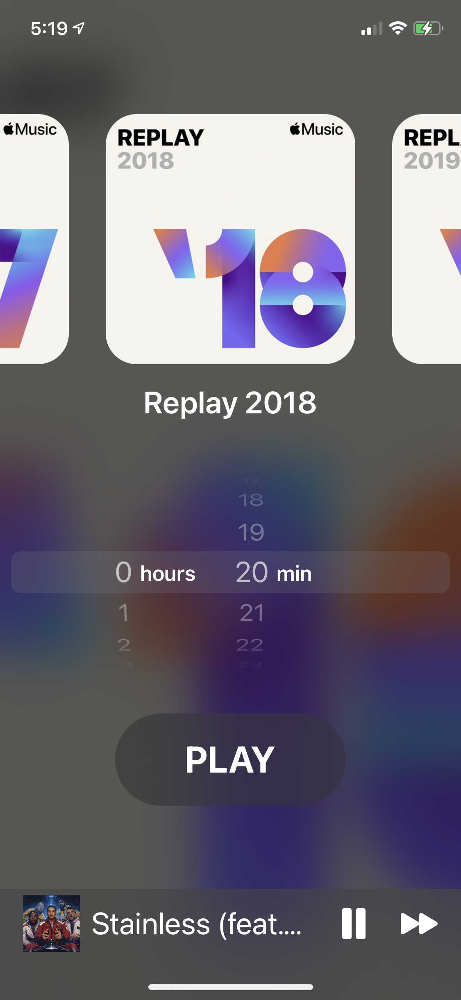

# MusicTimer
An application that will choose the exact number of songs to be played for a given time limit. All you have to do is select a playlist from your Apple Music library and choose a time. It will then play the exact number of songs it needs to add up to the given time.

This application has gone through a few iterations that changed mainly the UI/UX but also some of the functionality of it.

# Screenshots
  
